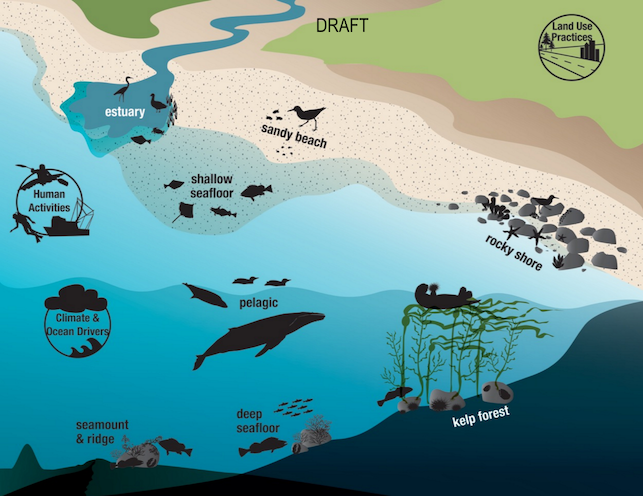
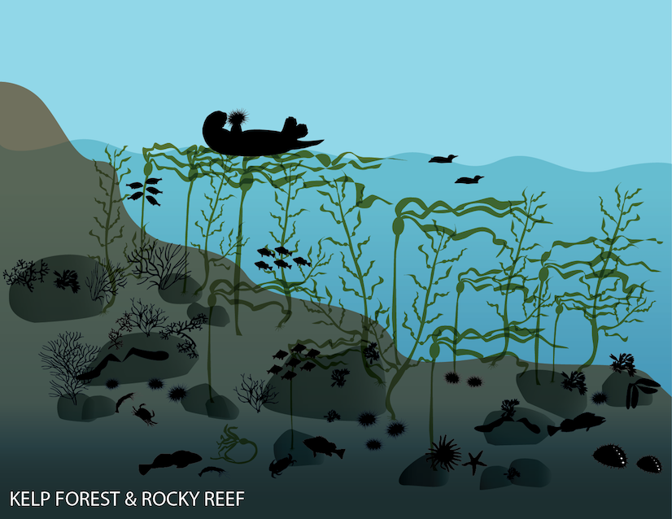
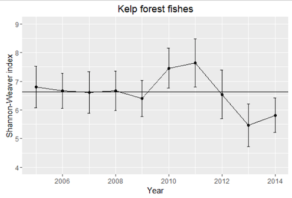

# Applications

Here we describe applications with conceptual process overviews and technical implementation details.

## Interactive Infographics

### Product Overview

Jenn Brown concieved of a vision for making complex information readily available to managers and the public through an interactive infographic, that is navigable via:

1. Overview of Habitats

2. Species by Habitat

3. Time Series

This is a data-driven framework in support of National Marine Sanctuaries Condition Report and Management Plans.

Here are picture examples:

1. Overview of Habitats

    

2. Species by Habitat

    

3. Time Series

    

We've identified 3 phases of development to successfully generate this produce for any given setting:

1. **Design**

audience: managers, scientists

2. **Implementation**

audience: data and web technicians

3. **Feedback**

Gather feeback (like A/B testing) from users and iterate on Design and Implementation.

### Design Process

audience: managers, scientists

- What are the key habitats for your study area?

- Within these habitats, what are the key species and indicators?

- For these species and indicators, what datasets are available to inform them?

- What is the minimum criteria for inclusion of dataset? eg > 5 years of surveys covering > 50% of study area

- For a given dataset what are the key metrics and how do the values get binned into different categories? Example categories:

    - unprecedented decreasing
    - decreasing
    - stable
    - increasing
    - unprecedented increasing
    - data deficient

### Implementation Details

audience: data and web technicians

This product is intended for hosting on a simple web server, without need for backend server-side programming. It will be generated from data products on a daily basis and involves the following elemnts:

- **Infographic**. These will be rendered using scalable vector graphics (SVG) icons color coded and clickable.

- **Time-series plots**. These interactive plots will be pre-generated from parameterized Rmarkdown documents.

### Gather Feedback and Iterate

Gather feeback (like A/B testing) from users and iterate on Design and Implementation.

